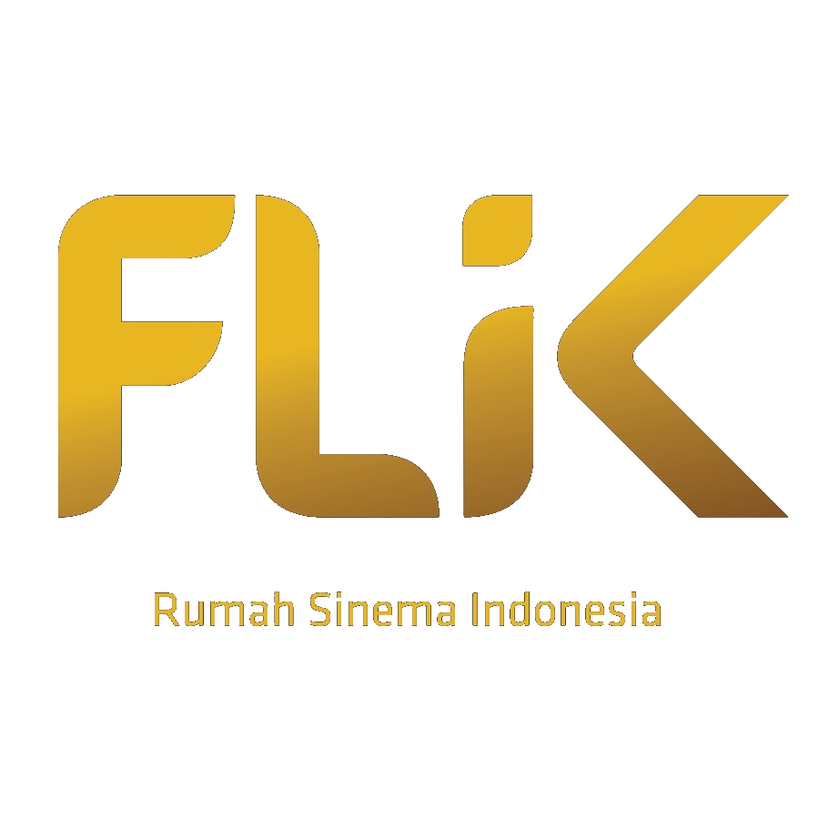

<h1 align="center">
  
  <br>
  FLiK — Rumah Sinema Indonesia
</h1>

<p align="center">
  Platform streaming film premium Indonesia dengan koleksi terlengkap dari film klasik legendaris hingga karya terbaru.
</p>

<p align="center">
  
  
  
  
  
</p>

---

## ✨ Features

- 🎬 **Film Library** — Koleksi film Indonesia terlengkap dengan metadata TMDB
- 🎭 **Cast & Genre** — Database pemain & genre lengkap
- ⭐ **Ratings & Reviews** — Rating komunitas & komentar bersarang
- 📋 **Watchlist** — Simpan film favorit untuk ditonton nanti
- 🎮 **Gamifikasi** — Sistem XP, levels, coins, achievements, & daily rewards
- 💳 **Payment Gateway** — Integrasi Midtrans (auto-disabled jika ENV belum diset)
- 📺 **Video Player** — Video.js dengan progress tracking & resume playback
- 🔍 **Live Search** — Real-time search dengan Livewire
- 👤 **Profile** — Profil pengguna dengan level, badges, & aktivitas
- 🔐 **Auth** — Login/Register + Google OAuth
- 📱 **PWA** — Progressive Web App, bisa di-install di mobile
- 🛡️ **Admin Panel** — CRUD Movies, Genres, Casts, Users, Banners
- 🌙 **Dark Mode** — Full dark theme dengan gold accent (#C5A55A)

## 🛠️ Tech Stack

| Layer | Technology |
|-------|-----------|
| Backend | Laravel 9.x, PHP 8.0+ |
| Frontend | TailwindCSS, Alpine.js, Livewire |
| Video | Video.js |
| Payment | Midtrans Snap |
| Database | MySQL 8.0+ |
| Build | Vite |

## 📋 Requirements

| Package | Version |
|---------|---------|
| [PHP](https://www.php.net/) | 8.0+ |
| [Composer](https://getcomposer.org/) | 2.x |
| [Node.js](https://nodejs.org/) | 14+ |
| [MySQL](https://www.mysql.com/) | 8.0+ |

## 🚀 Installation

```bash
# 1. Clone repo
git clone https://github.com/pendtiumpraz/flik.git
cd flik

# 2. Copy environment file
cp .env.example .env

# 3. Install dependencies
composer install
npm install

# 4. Generate app key
php artisan key:generate

# 5. Create database 'velflix' di MySQL
# 6. Configure .env (lihat .env.example untuk panduan lengkap)

# 7. Run migrations & seeders
php artisan migrate
php artisan db:seed

# 8. Create storage symlink
php artisan storage:link

# 9. Build assets
npm run build

# 10. Start server
php artisan serve
```

Visit `http://localhost:8000`

### Default Accounts

| Role | Email | Password |
|------|-------|----------|
| Admin | admin@gmail.com | password |
| User | user@gmail.com | password |

## ⚙️ Environment Configuration

FLiK menggunakan pendekatan **ENV-first** — fitur otomatis aktif/nonaktif berdasarkan environment variables:

### Payment Gateway (Midtrans)
```env
# Jika TIDAK diisi → tombol payment otomatis disabled ("Coming Soon")
MIDTRANS_SERVER_KEY=
MIDTRANS_CLIENT_KEY=
MIDTRANS_IS_PRODUCTION=false
```

### Video Storage
```env
# Default: "public" (Laravel local storage)
# Options: "public", "s3", "azure", "alibaba"
FILESYSTEM_DISK=public

# S3 (DigitalOcean Spaces / MinIO compatible)
AWS_ACCESS_KEY_ID=
AWS_SECRET_ACCESS_KEY=
AWS_BUCKET=
```

### External APIs
```env
TMDB_TOKEN=                    # The Movie Database API
GOOGLE_CLIENT_ID=              # Google OAuth
GOOGLE_CLIENT_SECRET=
```

> Lihat `.env.example` untuk konfigurasi lengkap.

## 📁 Project Structure

```
flik/
├── app/
│   ├── Http/Controllers/     # AdminController, PaymentController, etc.
│   ├── Models/               # Movie, Genre, Cast, User, etc.
│   └── Http/Livewire/        # SearchFlik (live search)
├── resources/views/
│   ├── admin/                # Admin panel views
│   ├── auth/                 # Login & Register (OTT premium design)
│   ├── components/           # Blade components
│   ├── payment/              # Checkout view
│   ├── plans/                # Subscription plans
│   ├── profile/              # User profile
│   ├── rewards/              # Gamification rewards
│   └── home.blade.php        # Landing page
├── public/img/               # Hero images, logo, etc.
└── database/
    ├── migrations/           # 15+ migrations
    └── seeders/              # Movie, Genre, Cast, Plan seeders
```

## 🎨 Design System

- **Primary Gold**: `#C5A55A` — accent color, buttons, highlights
- **Background**: `#0a0a0a` — deep black
- **Font Heading**: Outfit
- **Font Body**: Inter
- **UI Style**: OTT Premium, glassmorphism, gold gradients

## 📱 PWA Support

FLiK supports Progressive Web App installation:
- Add to home screen on mobile
- Offline caching for core assets
- Service worker with network-first strategy

## 🤝 Contributing

Contributions are welcome! Please see [CONTRIBUTING](CONTRIBUTING.md) for details.

## 📄 License

FLiK is open-sourced software licensed under [the MIT license](LICENSE).

---

<p align="center">
  <strong>FLiK</strong> — Rumah Sinema Indonesia 🇮🇩
</p>
